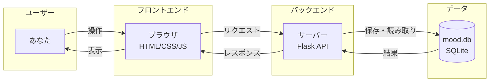
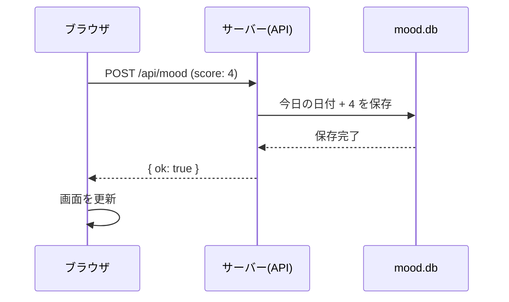

# 朝イチ気分チェック — アーキテクチャ図解（やさしく）

「どこに何があって、どうつながっているか」を図で説明します。

---

## 1. 全体の姿（3つのブロック）

```
┌─────────────────────────────────────────────────────────────────┐
│  あなた（ユーザー）                                                │
│  「今日の気分は4」と選んでボタンを押す                              │
└───────────────────────────┬─────────────────────────────────────┘
                            │
                            ▼
┌─────────────────────────────────────────────────────────────────┐
│  ブラウザ（フロントエンド）                                         │
│  • 画面を表示する（HTML / CSS / JavaScript）                        │
│  • ボタンを押したら「サーバーに 4 を送って」とお願いする               │
└───────────────────────────┬─────────────────────────────────────┘
                            │  http://localhost:5001/api/mood に送る
                            ▼
┌─────────────────────────────────────────────────────────────────┐
│  サーバー（バックエンド・API）                                      │
│  • あなたのPCのなかで動いているプログラム（Python + Flask）           │
│  • 「4 を受け取った → 今日の日付と一緒に保存して」と指示する            │
└───────────────────────────┬─────────────────────────────────────┘
                            │  保存して
                            ▼
┌─────────────────────────────────────────────────────────────────┐
│  データベース（DB）                                                 │
│  • 気分の記録をしまっておく「金庫」（SQLite = ファイル1つ）             │
│  • 例： 2026/3/8 → 4  が保存されている                              │
└─────────────────────────────────────────────────────────────────┘
```

**ポイント**: あなた → ブラウザ → サーバー（API）→ DB の順で「気分」が流れていきます。

---

## 2. 用語の対応（比喩）

| 用語 | やさしく言うと |
|------|----------------|
| **フロントエンド** | ブラウザで見ている「画面」と、その画面を動かすプログラム（HTML / CSS / JS） |
| **API** | サーバーが用意した「窓口」。ブラウザが「今日の気分を保存して」と頼むと、APIが受け取ってDBに保存する。 |
| **バックエンド** | サーバーのなかで動いているプログラム（ここでは Python + Flask）。APIの処理をしている。 |
| **DB（データベース）** | 記録を長く残しておく場所。ここでは SQLite で、`mood.db` というファイル1つ。 |
| **インフラ** | 「そのプログラムをどこで・どう動かすか」。ここでは「あなたのPCのなかでサーバーを起動する」がインフラ。 |

---

## 2.5 もっとやさしく：HTML / CSS / JS の違い

**お店の看板にたとえると：**

| 役割 | やること（一言） | たとえ |
|------|------------------|--------|
| **HTML** | 「何があるか」を決める | 看板に「ボタンが5個」「見出し」「グラフの枠」と**書いてある内容（骨組み）** |
| **CSS** | 「どう見えるか」を決める | 色・大きさ・並び方。**看板のデザイン**（緑のボタン、白い背景など） |
| **JavaScript（JS）** | 「押したら何をするか」を決める | ボタンを押したらサーバーに送る・グラフを描く。**看板の動き・ルール** |

- **HTML** ＝ 部品の名前と並び（「ここにボタン」「ここにグラフ」）
- **CSS** ＝ 見た目だけ（色・形・レイアウト）
- **JS** ＝ 操作に反応する（クリック・送信・表示の更新）

---

## 2.6 Python（Flask）と API の違い

**「お店」と「窓口」の関係です。**

| 言い方 | 意味 |
|--------|------|
| **Python** | プログラミング言語の名前。「この言語でプログラムを書く」という道具。 |
| **Flask** | Python 用の「Webサーバーを簡単に作るための道具」。Python の追加パックのようなもの。 |
| **API** | そのプログラムが「外から受け付ける窓口」の**役割・約束**。「ここにこう送れば、こう返す」というルール。 |

**図で言うと：**

- **Python + Flask** ＝ **お店そのもの**（建物と店員）。中で「リクエストを受け取る」「DBに保存する」という**処理**を書いている。
- **API** ＝ そのお店の**窓口**。「気分を保存して」という依頼を受け付ける場所（例：`/api/mood`）。

だから「Python（Flask）で作ったプログラムが、API という窓口を用意している」という関係です。  
**API ＝ 窓口の名前・ルール。Python（Flask）＝ その窓口を動かしているプログラム。**

---

## 2.7 SQLite ってなに？

**「データを入れておく、ファイル1つの金庫」です。**

| ポイント | 説明 |
|----------|------|
| **何か** | データベースの一種。**ファイルが1つ**（このアプリでは `mood.db`）だけあれば動く。 |
| **他のDBとの違い** | 多くのDBは「専用のサーバーを別で用意」する。SQLite は**サーバー不要**で、アプリと同じPCにファイルを置くだけ。 |
| **何ができるか** | 日付と気分（1〜5）のような**表形式のデータ**を保存・検索する。 |
| **たとえ** | Excel のシートのような「表」が1つのファイルにまとまっているイメージ。アプリがそのファイルを読み書きする。 |

**このアプリでは**  
`mood.db` という1つのファイルに「いつ（日付）・何点（1〜5）」が記録されています。サーバー（Python）が「保存して」「読んで」とそのファイルにアクセスしています。

---

## 3. ボタンを押したときの流れ（シーケンス）

```
  ブラウザ                    サーバー（API）                  DB（mood.db）
     │                              │                              │
     │   POST /api/mood              │                              │
     │   「score: 4」を送る           │                              │
     │ ───────────────────────────►  │                              │
     │                              │  今日の日付 + 4 を保存して      │
     │                              │ ────────────────────────────► │
     │                              │                              │
     │                              │  「保存したよ」                 │
     │                              │ ◄──────────────────────────── │
     │  「ok: true」と返す            │                              │
     │ ◄─────────────────────────── │                              │
     │                              │                              │
     │  画面を更新する                │                              │
     │  （記録済み・グラフ・一覧）     │                              │
     │                              │                              │
```

- **ブラウザ**: ボタンが押されたら「4」をサーバーに送る（POST）。
- **サーバー**: 受け取った「4」と今日の日付をDBに保存し、「ok」と返す。
- **ブラウザ**: 返事をもらったら、画面の「今日の気分」「グラフ」「過去の記録」を更新する。

---

## 4. ファイルと役割の対応

```
daily-mood-checkin/
│
├── app.py                 … サーバー（API）。「気分を保存」「今日の気分を返す」「一覧を返す」を担当
├── mood.db                … DB。気分の記録が入っているファイル（SQLite）
├── requirements.txt       … サーバーを動かすのに必要なライブラリ一覧
│
├── static/
│   ├── index.html         … 画面の骨組み（フロントエンド）
│   ├── style.css          … 見た目（色・レイアウト）
│   └── app.js             … 画面の動き（ボタン・API呼び出し・グラフ表示）
│
├── サーバーを起動.command   … サーバーを起動するためのショートカット
└── scripts/               … ログイン時にサーバーを起動する設定など
```

- **DB** = `mood.db`（中身は日付とスコアの一覧）
- **API** = `app.py` の `/api/today`, `/api/mood`, `/api/moods` など
- **インフラ** = 「サーバーを起動.command」や Launch Agent（あなたのPCでサーバーを動かす仕組み）

---

## 5. インフラのイメージ（いまの構成）

```
  Mac にログイン
        │
        ▼
  Launch Agent が動く（設定している場合）
        │
        ▼
  あなたのPCのなかで「サーバー（app.py）」が起動
        │
        ▼
  ブラウザで http://localhost:5001 を開く
        │
        ▼
  同じPCのなかで、ブラウザ ⇄ サーバー がやりとり
  （DB も同じPCの mood.db に保存）
```

**インフラ = 「サーバーをどこで動かすか」**  
今は「あなたのMacのなか」だけなので、同じPCのなかでブラウザ・API・DBが全部つながっています。

---

## 6. 図のまとめ（Mermaid）

以下は Mermaid という形式の図です。GitHub や Mermaid 対応のビューアで見ると図として表示されます。

### 全体構成



### ボタン押下の流れ



---

*このアプリは「フロントエンド（ブラウザ）」「API（バックエンド）」「DB」「インフラ（同じPCでサーバーを動かす）」の4つで成り立っています。*
